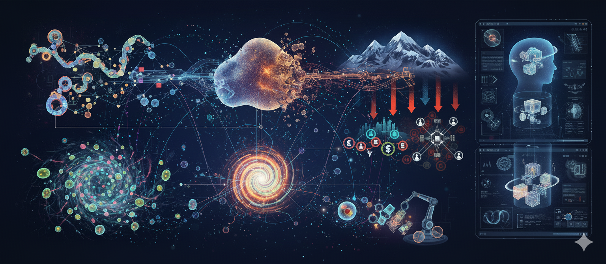
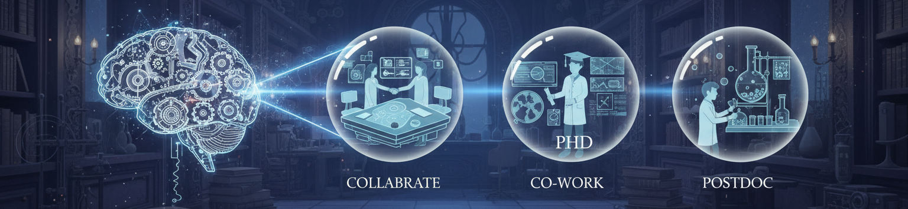

<html lang="en">
<head>
    <meta charset="UTF-8">
    <meta name="viewport" content="width=device-width, initial-scale=1.0">
    <title>iLab - Portfolio</title>
    <link href="https://fonts.googleapis.com/css2?family=Playfair+Display:wght@400;700&family=Open+Sans:wght@300;400;600&family=Montserrat:wght@400;700&display=swap" rel="stylesheet">
    
</head>
<body>

    <!-- MODIFIED HEADER FOR TWO-ROW LAYOUT -->
    <header class="main-header">
        <!-- Top Row: Title -->
        

            
Physics+AI

        

        <!-- Bottom Row: Navigation Links -->
        <nav class="navbar">
            <ul class="nav-links">
                <li><a href="#highlight" class="nav-link active">Home</a></li>
                <li><a href="#research" class="nav-link">Research</a></li>
                <li><a href="#publication" class="nav-link">Publication</a></li>
                <li><a href="#teaching" class="nav-link">Teaching</a></li>
                <li><a href="#about" class="nav-link">About</a></li>
                <li><a href="#outreach" class="nav-link">Outreach</a></li>
                <li><a href="#latest" class="nav-link">Latest</a></li>
                <!-- NEW PAGES ADDED HERE -->
                <li><a href="#classroom" class="nav-link">Live Class Room</a></li>
                <li><a href="#products" class="nav-link">Lab Products</a></li>
                <li><a href="#misc" class="nav-link">misc</a></li>
                <li><a href="#playground" class="nav-link">Playground</a></li>
            </ul>
        </nav>
    </header>

    

        <!-- 1. Highlight Page -->
        

            
           
            <h2> Hello World !</h2>
            
We are a group of creative researchers exploring physics at the interface of artificial intelligence, working in a deeply collaborative and interdisciplinary setting. Our goal is to understand complex systems and to see how modern computational approaches, especially deep learning, can contribute to solutions for societal good. Our main research interests include:

            <ul>
                <li><b>Collective Intelligence in Natural and Artificial Systems:</b> How do large groups of individual agents—be they birds in a flock, cells in a tissue, or robots in a swarm—coordinate to achieve complex, group-level goals? We explore the physical principles behind this emergent intelligence, studying how local rules and interactions give rise to sophisticated collective behaviors in both living and engineered systems.</li>
                <li><b>Physics of Living Matter:</b> We view biological tissues as a form of active matter. We study the collective migration and self-organization of cells to better understand fundamental processes like wound healing, tissue development, and morphogenesis. By creating computational models that capture the interplay between cellular forces and signaling, we hope to contribute insights that could one day aid in regenerative medicine.</li>
                <li><b>Mechanics of Disordered Materials:</b> Materials like glasses and granular packings lack a perfect crystal structure, which makes predicting their behavior, particularly failure, a difficult challenge. We investigate the fundamental mechanics of these systems, applying machine learning techniques to identify subtle structural precursors to failure. Our goal is to contribute to a more predictive science of materials, which is essential for designing more resilient and safer structures.</li>
                <li><b>AI as a Tool for Scientific Discovery:</b> A common thread through all our research is the use of deep learning not just for prediction, but as a tool for gaining fundamental insight. We are committed to developing simple models by machine intelligence (MI).  We aim to uncover the underlying physical principles our models have learned, helping us to formulate new hypotheses and deepen our understanding of the complex natural systems we study.</li>
            </ul>
            
We thrive on a close partnership with experimentalists and other theorists, creating a dynamic environment for learning and discovery.

            

                <h3>🌟 Highlights</h3>
                <ul>
                    <li><strong>Research Interests:</strong> Investigating the dynamics of natural and artificial complex systems, with a focus on out-of-equilibrium soft, glassy, and active matter.</li>
                    <li><strong>Physics at the Interface of AI:</strong> By training models from physical systems, we integrate fundamental physical laws into novel AI models. This involves using high-performance computing and explainable AI to decode molecular information processing, predict material failure, and attempts to understand emergent behaviors in living and artificial systems.</li>
                    <li><strong>Teaching and Mentoring:</strong> Engaged in teaching courses such as Mathematics for AI and Intelligent Systems, and mentoring research interns and graduate students.</li>
                </ul>
            

            

                <h2>🌟 Join Us </h2>
                

                    <h1>Join Us to Innovate</h1>
                    
 We are seeking creative individuals to join our lab to co-create the future.

           
                    
Whether you are an established researcher, a budding scientist, or a creative force eager to collaborate, we have a place for you. We are actively seeking passionate individuals for:

           
                    

                        
Collaborative Projects

                        
Internship Opportunities

                        
PhD Positions

                        
Postdoctoral Fellowships

                    

           
                    
Find your chance to work on projects that matter, surrounded by a team to pushing the boundaries of what's possible. We believe in the power of diversity and the magic that happens when generative minds connect.

           
                    

                        <h2>Ready to answer the call?</h2>
                        
We want to hear from you: your vision and plans with us. Email your one-page CV, a well supported SOP

                        <a href="mailto:sumandutta.avvcb@gmail.com" class="email-link">Submit</a>
                    

           
                    
Let's build the future together.

                

                
            

        

        <!-- 2. Research Page -->
        

            <h2>🔬 Research Interests & Competencies</h2>
            

                <h3>Research Expertise</h3>
                <ul>
                    <li><strong>Domain Expertise:</strong> Collective Intelligence in Living and Artificial Systems, Physics of Complex Fluids, Soft Condensed Matter. </li>
                    <li><strong>Core Competencies:</strong> Creative Research, Out-of-Equilibrium Statistical Physics, Machine Learning Order Disorder.</li>
                </ul>
            

            

                
                
            

            

                <h3>Key Research Areas</h3>
                <ul>
                    <li class="research-area-item"><strong>Soft, Glassy, Active & Adaptable Matter</strong></li>
                    <li class="research-area-item"><strong>Physics of Flow, Glass & Living Machines</strong></li>
                    <li class="research-area-item"><strong>Material Failure and Molecular Information Processing</strong></li>
                    <li class="research-area-item"><strong>Mechanobiology, Catastrophe Science, Emergent Intelligence</strong></li>
                </ul>
            

            

                <h3>Extensive Experience in</h3>
                <ul>
                    <li>Soft Condensed Matter</li>
                    <li>High Performance Computing (Molecular Simulations)</li>
                </ul>
            

            

                <h3>Research within the Group</h3>
                
We perform extensive computer simulations, harnessing the power of High-Performance Computing (HPC), alongside statistical methods. Our aim is to develop and deploy data-driven yet inherently explainable techniques. These methods are meticulously designed to systematically investigate the intricate complex processes that drive autonomous organization and the phenomena of failure in both living and artificial systems. Our approach bridges the gap between complex data analysis and fundamental scientific understanding, ensuring our findings are not only predictive but also interpretable.

                
Our research endeavors delve into several key directions, offering a comprehensive exploration of complex systems:

                <ul>
                    <li><strong>Molecular Information Processing:</strong> We meticulously decode how molecular systems store, manipulate, and relay information. This involves unraveling the fundamental principles that govern adaptive behaviors observed in both natural biological networks and synthetic molecular constructs. By understanding these intricate mechanisms, we aim to engineer more sophisticated and responsive artificial systems.</li>
                    <li><strong>Cellular Migration and Turbulence:</strong> We investigate the often chaotic and dynamic patterns exhibited by migrating cells. This research focuses on understanding their collective dynamics during critical biological processes such as tissue formation, repair, and in cases of failure. By analyzing these complex movements, we gain insights into emergent behaviors and the underlying physical constraints.</li>
                    <li><strong>Failure and Jamming of Amorphous Systems:</strong> A significant area of our work explores the transitions of disordered materials between fluid-like and rigid states. We aim to develop predictive models that can accurately forecast their resilience, pinpoint critical points of failure, and understand the jamming phenomena that can lead to material collapse.</li>
                    <li><strong>Predicting Vulnerability and Avalanches:</strong> We develop models that capture the dynamics of critical cascades—phenomena ranging from natural avalanches to the interconnectedness of economic societies. Our goal is to forecast the likelihood and potential impact of systemic failures, thereby enabling proactive mitigation strategies.</li>
                    <li><strong>Autonomous and Critical Phenomena in Living and Artificial Systems:</strong> We are deeply interested in the emergence of self-organized behaviors in systems poised at critical thresholds. By studying these systems, we aim to uncover the delicate balance between stability and adaptability, and how these seemingly opposing forces coexist to drive complex system evolution.</li>
                    <li><strong>Generative Physical Intelligence:</strong> We are pioneering the development of novel generative models that are deeply integrated with the fundamental laws of physics. This research aims to create AI systems capable of not only predicting but also generating physically plausible dynamics and structures. By teaching models the principles of statistical mechanics and emergent phenomena, we seek to build intelligent agents that can autonomously discover new materials, understand system failures, and generate innovative solutions to a complex physical challenges.</li>
                </ul>
            

        

        <!-- Publication Page -->
        

            <h2>📚 Publications</h2>
            

               
                <h3>2025</h3>
                

                    
S. Santra, L. Touzo, C. Dasgupta, A. Dhar, <u>S. Dutta</u>, A. Kundu, P. Le Doussal, G. Schehr & P. Singh, <em>Crystal to liquid cross-over in the active Calogero-Moser model</em>, J. Stat. Mech. 033203 (2025) [<a href="https://iopscience.iop.org/article/10.1088/1742-5468/adbb5d" target="_blank" rel="noopener noreferrer">LINK</a>]

                    
<strong>Contribution:</strong> <u>Contributing author</u>

                

                

                    
V. Vaibhav, T. Das & <u>S. Dutta</u>*, <em>Persistently Non-Gaussian Metastable Liquids</em>, arXiv:2511.07951 (2025) [<a href="https://arxiv.org/abs/2511.07951" target="_blank" rel="noopener noreferrer">LINK</a>]

                    
<strong>Contribution:</strong> <u>Corresponding author</u>

                

                

                    
<u>S. Dutta</u>*, P. Chaudhuri, M. Rao & C. Dasgupta, <em>Activity-driven sorting, approach to criticality and turbulent flows in dense persistent active fluids</em>, arXiv:2509.00376 (2025)  [<a href="https://arxiv.org/abs/2509.00376" target="_blank" rel="noopener noreferrer">LINK</a>] 

                    
<strong>Contribution:</strong> <u>First and Corresponding author</u>

                

               
                <h3>2024</h3>
                

                    
V. Vaibhav & <u>S. Dutta</u>*, <em>Entropic timescales of Dynamic Heterogeneity in Supercooled Liquid</em>, Phys. Rev. E (Lett.), <strong>109</strong>, L062102 (2024) [<a href="https://journals.aps.org/pre/abstract/10.1103/PhysRevE.109.L062102" target="_blank" rel="noopener noreferrer">LINK</a>]

                    
<strong>Contribution:</strong> <u>Corresponding author</u>

                

                <h3>2023</h3>
                

                    
<u>S. Dutta</u>, K. Martens & P. Chaudhuri, <em>Creep response of athermal amorphous solids under imposed shear stress</em>, arXiv:2303.04718 (2023) [<a href="https://arxiv.org/abs/2303.04718" target="_blank" rel="noopener noreferrer">LINK</a>]

                    
<strong>Contribution:</strong> <u>First author</u>

                

               
                <h3>2021</h3>
                

                    
C. Liu, <u>S. Dutta</u>, P. Chaudhuri & K. Martens, <em>Elastoplastic approach based on microscopic insights for the steady state and transient dynamics of sheared disordered solids</em>, Phys. Rev. Lett., <strong>126</strong>, 138005 (2021) [<a href="https://journals.aps.org/prl/abstract/10.1103/PhysRevLett.126.138005" target="_blank" rel="noopener noreferrer">LINK</a>]

                    
<strong>Contribution:</strong> <u>Joint first author</u>

                

                <h3>2020</h3>
                

                    
R. Dandekar, S. Bose & <u>S. Dutta</u>*, <em>Non-Gaussian information of heterogeneity in soft matter</em>, Europhys. Lett., <strong>131</strong>, 18002 (2020) [<a href="https://iopscience.iop.org/article/10.1209/0295-5075/131/18002/meta" target="_blank" rel="noopener noreferrer">LINK</a>]

                    
<strong>Contribution:</strong> <u>Corresponding author</u>

                

                

                    
<u>S. Dutta</u>* & J. Chakrabarti, <em>Length-scales of dynamic heterogeneity in a driven binary colloid</em>, Phys. Chem. Chem. Phys., <strong>22</strong>, 17731 (2020) [<a href="https://pubs.rsc.org/en/content/articlelanding/2020/cp/d0cp02703k/unauth" target="_blank" rel="noopener noreferrer">LINK</a>]

                    
<strong>Contribution:</strong> <u>First and Corresponding author</u>

                

                <h3>2019</h3>
                

                    
<u>S. Dutta</u>*, <em>Microscopic insights into dynamical heterogeneity in a lane forming colloid</em>, Chem. Phys., <strong>522</strong>, 256 (2019) [<a href="https://www.sciencedirect.com/science/article/pii/S0301010418311510" target="_blank" rel="noopener noreferrer">LINK</a>]

                    
<strong>Contribution:</strong> <u>Solo author</u>

                

                <h3>2018</h3>
                

                    
<u>S. Dutta</u>* & J. Chakrabarti, <em>Transient dynamical responses of a charged binary colloid in an electric field</em>, Soft Matter, <strong>14</strong>, 4477 (2018) [<a href="https://pubs.rsc.org/en/content/articlehtml/2018/sm/c7sm02552a" target="_blank" rel="noopener noreferrer">LINK</a>]

                    
<strong>Contribution:</strong> <u>First and Corresponding author</u>

                

                <h3>2016</h3>
                

                    
<u>S. Dutta</u>* & J. Chakrabarti, <em>Anomalous dynamical responses in a driven system</em>, Europhys. Lett., <strong>116</strong>, 38001 (2016) [<a href="https://iopscience.iop.org/article/10.1209/0295-5075/116/38001/meta" target="_blank" rel="noopener noreferrer">LINK</a>]

                    
<strong>Contribution:</strong> <u>First author</u>

                

                <h3>2015</h3>
                

                    
J. Chakrabarti & <u>S. Dutta</u>, <em>Analytical form of forces in hydrophobic collapse</em>, Chem. Phys. Lett., 620, <strong>109</strong> (2015) [<a href="https://www.sciencedirect.com/science/article/pii/S0009261414010483" target="_blank" rel="noopener noreferrer">LINK</a>]

                    
<strong>Contribution:</strong> <u>Second author</u>

                

            

        

        <!-- 3. Teaching Page (REDESIGNED) -->
        

            <h2>💡 Teaching & Mentoring</h2>
           
            <!-- TEACHING DASHBOARD -->
            

                

                    Explore our academic engagements, mentoring programs, and pedagogical philosophy.
                

               
                

                    <!-- Card 1: Academic Courses -->
                    

                        

                            <h4>👨‍🏫 Academic Courses</h4>
                            
<strong>Focus:</strong> AI, Mathematics & Material Science

                            
Courses delivered at Amrita Vishwa Vidyapeetham and guest lectures.

                            <ul style="margin-top:10px; font-size: 0.9em; color: var(--secondary-color);">
                                <li>Material Informatics</li>
                                <li>Math for Intelligent Systems</li>
                                <li>Research Methodology</li>
                            </ul>
                        

                        

                            View Course List &rarr;
                        

                    

                    <!-- Card 2: Mentoring -->
                    

                        

                            <h4>🤝 Mentoring & Supervision</h4>
                            
<strong>Role:</strong> Advisor & Co-Supervisor

                            
Guiding research interns, Masters thesis students, and student collaborators.

                            

                                Interns
                                Thesis
                            

                        

                        

                            View Student Profiles &rarr;
                        

                    

                    <!-- Card 3: Philosophy -->
                    

                        

                            <h4>🧠 Teaching Philosophy</h4>
                            
<strong>Approach:</strong> Interactive & Generative

                            
Believing in "Learning by Doing" and bridging the gap between theoretical Physics and applied AI.

                        

                        

                            Read Methodology &rarr;
                        

                    

                

            

            <!-- DETAILED VIEW: ACADEMIC COURSES -->
            

                <button class="back-btn" onclick="closeTeachingSection()">
                    <svg xmlns="http://www.w3.org/2000/svg" width="16" height="16" viewBox="0 0 24 24"><path d="M20 11H7.83l5.59-5.59L12 4l-8 8 8 8 1.41-1.41L7.83 13H20v-2z"/></svg>
                    Back to Dashboard
                </button>
                

                    <h3>Courses Taught</h3>
                    <ul>
                        
<table>
    <thead>
        <tr>
            <th>Course Code</th>
            <th>Credit</th>
            <th>Contact Hrs</th>
            <th>Session</th>
            <th>Students</th>
            <th>TLP-Feedback</th>
        </tr>
    </thead>
    <tbody>
        <tr>
            <td>B.Tech..2025.R.AID.1.23CHY115</td>
            <td>3</td>
            <td>4</td>
            <td>2025-26 Even</td>
            <td>65</td>
            <td>Ongoing</td>
        </tr>
        <tr>
            <td>B.Tech..2025.R.AID.2.23CHY115</td>
            <td>3</td>
            <td>4</td>
            <td>2025-26 Even</td>
            <td>66</td>
            <td>Ongoing</td>
        </tr>
        <tr>
            <td>B.Tech..2025.R.AID.1.23MAT106</td>
            <td>4</td>
            <td>5</td>
            <td>2025-26 Odd</td>
            <td>65</td>
            <td>90.81%</td>
        </tr>
        <tr>
            <td>B.Tech..2025.R.AID.2.23MAT106</td>
            <td>4</td>
            <td>5</td>
            <td>2025-26 Odd</td>
            <td>66</td>
            <td>95.41%</td>
        </tr>
    </tbody>
</table>
                    </ul>
                

            

            <!-- DETAILED VIEW: MENTORING -->
            

                <button class="back-btn" onclick="closeTeachingSection()">
                    <svg xmlns="http://www.w3.org/2000/svg" width="16" height="16" viewBox="0 0 24 24"><path d="M20 11H7.83l5.59-5.59L12 4l-8 8 8 8 1.41-1.41L7.83 13H20v-2z"/></svg>
                    Back to Dashboard
                </button>
                

                    <h3>Research Supervision</h3>
                    

                        <strong>Research Interns</strong>
                        
A. Jagdish, School of Physical Sciences, Amrita Vishwa Vidyapeetham (06/2025 onwards)

                    

                    

                        <strong>Student Collaborators</strong>
                        
A. Harish, A. Venkatraman, Department of Mathematics, Amrita Vishwa Vidyapeetham (06/2025 onwards)

                    

                    

                        <strong>Masters Thesis Co-supervision</strong>
                        
Magnus Olsen, <em>Understanding Non-Newtonian Materials</em>   (Supervisor: R. Cabriolu, Norwegian University of Science and Technology, since 08/2025)

                    

                

            

            <!-- DETAILED VIEW: PHILOSOPHY -->
            

                <button class="back-btn" onclick="closeTeachingSection()">
                    <svg xmlns="http://www.w3.org/2000/svg" width="16" height="16" viewBox="0 0 24 24"><path d="M20 11H7.83l5.59-5.59L12 4l-8 8 8 8 1.41-1.41L7.83 13H20v-2z"/></svg>
                    Back to Dashboard
                </button>
                

                    <h3>My Teaching Philosophy</h3>
                    
My approach to teaching is grounded in the belief that the interface between Physics and Artificial Intelligence provides a unique playground for intuitive understanding. I emphasize:

                    <ul>
                        <li><strong>Active Learning:</strong> Moving beyond lectures to include live coding sessions, simulation workshops, and "playground" style problem solving.</li>
                        <li><strong>Interdisciplinary Thinking:</strong> Encouraging students to see the mathematical structures common to both quantum mechanics and machine learning.</li>
                        <li><strong>Project-Based Assessment:</strong> Evaluating understanding through the creation of tangible models and tools (like our Lab Products) rather than just rote memorization.</li>
                    </ul>
                    
<em>"Education is not the learning of facts, but the training of the mind to think." - Albert Einstein</em>

                

            

        

        <!-- 4. About Me Page -->
        

            <h2>Group Leader</h2>
            

                
                

                    <h1>Suman Dutta</h1>
                    
Researcher | Intelligent Living & Artificial Systems

                

            

             <h2> About Me</h2>
            
I am a <strong>Creative</strong> researcher in the field of <strong>Intelligent Complex Systems</strong>, with a specialization in <strong>out-of-equilibrium Complex Fluids</strong>. I investigate model dynamics of <strong>Natural and Artificial Systems</strong>, combining <strong>Statistical Physics</strong>, <strong>High Performance Computing </strong> and <strong>Machine Intelligence</strong>, with an aim to develop strategies for <strong>Generative Physical Systems</strong>.

            

                <h3>🎓 Professional Journey</h3>
                <h4>Present Affiliation</h4>
                
<strong>Faculty Member, Department of Artificial Intelligence</strong> School of AI, Amrita Vishwa Vidyapeetham, Coimbatore HQ Joint Coordinator (Academic), B.Tech Programme (AI-Quantum Technology) (Since 03/2025)

                <h4>Professional Research Experience</h4>
                <ul>
                    <li><strong>Post Doctoral Fellow</strong> (01/2024 – 09/2024) Simons Centre for the Study of Living Machines, National Centre for Biological Sciences - Tata Institute of Fundamental Research, Bangalore (Advisor: M. Rao)</li>
                    <li><strong>Post Doctoral Fellow</strong> (01/2021 – 12/2023) International Centre for Theoretical Sciences - Tata Institute of Fundamental Research, Bangalore (Advisor: C. Dasgupta)</li>
                    <li><strong>Post Doctoral Fellow</strong> (02/2018 – 12/2020) The Institute of Mathematical Sciences, Chennai (Advisor: P. Chaudhuri, in collaboration with K. Martens)</li>
                </ul>
                <h4>Visiting Researcher Experience</h4>
                <ul>
                    <li>Fluvial Mechanics Laboratory Indian Statistical Institute (Kolkata, IN) </li>
                    <li>Department of Physics Indian Institute of Science (Bangalore, IN) </li>
                    <li>Department of Physics Indian Institute of Science Education and Research (Bhopal, IN) </li>
                    <li>Laboratoire Interdisciplinaire de Physique Universit´e Grenoble Alpes (Grenoble, FR) </li>
                    <li>Institut f¨ur Theoretische Physik II - Soft Matter Heinrich-Heine-Universit¨at (D¨usseldorf, DE) </li>
                </ul>
                <h4>Education</h4>
                <ul>
                    <li><strong>Ph.D in Physics</strong> (08/2012 – 01/2018) Department of Chemical, Biological and Macromolecular Sciences, S. N. Bose National Centre for Basic Sciences, Kolkata (Degree awarded by University of Calcutta)  <em>Thesis:</em> Numerical Studies on the Dynamics of Soft Matter Systems (Advisor: J. Chakrabarti)</li>
                    <li><strong>M.Sc in Physical Sciences</strong> (08/2010 – 07/2012) S. N. Bose National Centre for Basic Sciences (Degree awarded by West Bengal University of Technology, Kolkata)</li>
                </ul>
            

            <h2>📫 Connect</h2>
            

                

                    
                    
                    
                    
                

            

        

        <!-- NEW OUTREACH PAGE -->
        

            <h2>📢 Outreach & Community</h2>
            
Engaging with the scientific community and the public to demystify Physics and AI.

           
            

                <!-- Outreach Item 1 -->
                

                    🗣️
                    <h4>Talks</h4>
                    
Delivering lectures at premier institutes to foster collaboration and knowledge exchange.

                    <ul style="font-size: 0.9em; color: var(--secondary-color);">
                        <li>IISc Bangalore (2024)</li>
                        <li>IIT Madras (2023)</li>
                        <li>SN Bose Centre (2022)</li>
                    </ul>
                

               
                <!-- Outreach Item 2 -->
                

                    🛠️
                    <h4>Workshops</h4>
                    
Organizing hands-on sessions on High-Performance Computing and Molecular Dynamics.

                    
<em>"From Atoms to Algorithms" - Summer School Coordinator</em>

                

                <!-- Outreach Item 3 -->
                

                    🌍
                    <h4>Science Popularization</h4>
                    
Writing blogs and participating in open-house events to explain complex systems to high-school students.

                

               
                <!-- Outreach Item 4 -->
                

                    🏆
                    <h4>Competitions</h4>
                    
Mentoring student teams for Hackathons and AI-based Physics challenges.

                

            

           
            

                <h3>Featured Engagement</h3>
                

                    <strong>EuroHPC Summit 2025</strong>
                    
Participated in the panel discussion on "The Future of AI in Scientific Computing" representing the perspectives of soft matter physics.

                

            

        

        <!-- Latest News Page -->
        

            <h2>✨ Latest News</h2>
            

                

                    

    <h3 class="timeline-month">November 2025</h3>
    

        <strong>November 14: EuroHPC Benchmark Access Awarded for LUMI Clusters</strong>
        
We are pleased to announce that a computing grant for EuroHPC Benchmark Access has been awarded for the LUMI clusters, currently ranked as the 9th fastest supercomputer in the world. This grant provides computing for 2000 Node-Hours, with R. Cabriolu serving as Principal Investigator (PI) and Suman as Co-Principal Investigator (Co-PI).

                    
<h3 class="timeline-month">September 2025</h3>
<strong>September 24: Archit Selected for the flagship Biophysical Meeting at ICTS-TIFR Program</strong>
Archit has been selected for on-campus participation in the flagship- international meeting "Spatial Organization of Biological Functions", organized by the Biophysical Society, at ICTS-TIFR, scheduled for October 20-25. He will also present a poster on his work, "Learning Micro-Flocking Dynamics in Living Machines by Hybrid Machine Intelligence."

<strong>September 22: Agnevesh’s Research Tenure Extended</strong>
We are pleased to announce that Agnevesh's research tenure has been extended for an additional three months following a positive recommendation from a review panel.

<strong>September 15: ANRF Grant Proposal Advances</strong>
Our grant proposal, titled "Learning Order-Disorder by Machine Intelligence," has been successfully accepted for technical evaluation.

                    
<h3 class="timeline-month">August 2025</h3>
<strong>August 30: New Preprint on Dense Persistent Active Fluids</strong>
Our latest preprint, "Activity-driven sorting, approach to criticality and turbulent flows in dense persistent active fluids," is now available on arXiv. This collaborative work can be accessed at: <a href="https://arxiv.org/abs/2509.00376" target="_blank">arXiv:2509.00376</a>.

<strong>August 4-15: Agnevesh Participates in ICTS-TIFR Flagship School</strong>
Congratulations to our intern, Agnevesh, for his selection to participate in the prestigious flagship school "Data Science: Probabilistic and Optimization Methods II", held online by ICTS-TIFR.

                    
<h3 class="timeline-month">July 2025</h3>
<strong>July 12: Archit to Present at ICAMGT – 2025</strong>
Congratulations to our student collaborator, Archit, whose research on "Machine Learning Material Heterogeneity at Micro-scale" has been accepted for an oral presentation at the International Conference on Advanced Materials and Green Technology (ICAMGT – 2025).

                    
<h3 class="timeline-month">June 2025</h3>
<strong>June 2: Manuscript Submitted to Annalen der Physik</strong>
A new manuscript titled "Persistently Non-Gaussian Metastable Liquids" was submitted to *Annalen der Physik*.

                    
<h3 class="timeline-month">May – June 2025</h3>
<strong>May 28: Research Visit to ISI-Kolkata</strong>
Suman made a research visit to the Fluvial Mechanics Laboratory at the Indian Statistical Institute (ISI), Kolkata.

                    
<h3 class="timeline-month">March 2025</h3>
<strong>March 24: Joined Amrita Vishwa Vidyapeetham</strong>
Dr. Suman Dutta commenced his appointment as Assistant Professor (Sr. Gd.) at the School of AI, Amrita Vishwa Vidyapeetham, Coimbatore.

                

            

        

       
        <!-- NEW: Live Class Room Page -->
        

             <h2>🧑‍🏫 Live Class Room</h2>
             
             <!-- This container holds the password prompt -->
             

                 <h3>🔒 Access Restricted</h3>
                 
Please enter the passcode to view course materials.

                 <form id="password-form" class="password-form">
                     <input type="password" id="passcode-input" placeholder="Enter passcode" required>
                     <button type="submit">Unlock</button>
                 </form>
                 

             

             
             <!-- This container holds the protected content, hidden by default -->
             

               
                <!-- DASHBOARD VIEW -->
                

                    
Welcome to the Live Class Room. Select a course below to view details.

                    

                        <!-- Card 1: 23MAT106 -->
                        

                            

                                <h4>Mathematics for Intelligent Systems - I</h4>
                                
23MAT106 Fall 2025

                                
<strong>Subject:</strong> Linear Algebra, ODEs, Probability, Quantum Computing

                                
<strong>Credit:</strong> 4 

                                
<strong>Timeline:</strong> 6 Aug - 5 Dec, 2025 

                                
<strong>Students:</strong> BTech AID, Batch A and B (Total: 133 Students) First Year, First Semester 

                            

                            

                                Click to view Schedule, Syllabus & Notes &rarr;
                            

                        

                        <!-- Card 2: 23CHY115 -->
                        

                            

                                <h4>Material Informatics</h4>
                                
23CHY115 Spring 2026

                                
<strong>Subject:</strong> AI in Material Science

                                
<strong>Credit:</strong> 3 

                                
<strong>Timeline:</strong> Since 5 Jan 2026 

                                
<strong>Students:</strong> BTech AID, Batch A and B (Total: 129 Students) First Year, Second Semester

                            

                            

                                Click to view Schedule, Syllabus & Notes &rarr;
                            

                        

                    

                

                <!-- DETAILED VIEW: 23MAT106 -->
                

                    <button class="back-btn" onclick="closeCourse()">
                        <svg xmlns="http://www.w3.org/2000/svg" width="16" height="16" viewBox="0 0 24 24"><path d="M20 11H7.83l5.59-5.59L12 4l-8 8 8 8 1.41-1.41L7.83 13H20v-2z"/></svg>
                        Back to Dashboard
                    </button>
                   
                    

                        <h3>Course Details</h3>
                        <ul>
                            <li><strong>Class:</strong> BTech AID</li>
                            <li><strong>Semester:</strong> Fall, 2025 </li>
                            <li><strong>Course Code:</strong> 23MAT106</li>
                        </ul>
                    

                    

                        <!-- Updated the header to reflect the content -->
                        <h3>Combined Weekly Schedule</h3>

                        <!-- Sub-headers for the course details -->
                        
BTech (AID)

                        
Mathematics for Intelligent Systems - I - 23MAT106, School of AI, Amrita Vishwa Vidyapeetham

                        <!-- Outer container to simulate the tcolorbox border -->
                        

                            <!-- Main Schedule Table -->
                            <table style="width: 100%; border-collapse: collapse; text-align: center; font-family: sans-serif;">
                                <thead>
                                    <tr style="background-color: #F2F2F2;">
                                        <!-- Table Headers (thead) -->
                                        <th style="padding: 10px; border: 1px solid #ccc; font-weight: bold;">Time Slot</th>
                                        <th style="padding: 10px; border: 1px solid #ccc; font-weight: bold;">Monday</th>
                                        <th style="padding: 10px; border: 1px solid #ccc; font-weight: bold;">Tuesday</th>
                                        <th style="padding: 10px; border: 1px solid #ccc; font-weight: bold;">Wednesday</th>
                                        <th style="padding: 10px; border: 1px solid #ccc; font-weight: bold;">Thursday</th>
                                        <th style="padding: 10px; border: 1px solid #ccc; font-weight: bold;">Friday</th>
                                    </tr>
                                </thead>
                                <tbody>
                                    <!-- Row 1: 08:00 - 08:50 -->
                                    <tr>
                                        <td style="font-weight: bold; padding: 10px; border: 1px solid #ccc;">08:00 - 08:50</td>
                                        <td style="padding: 10px; border: 1px solid #ccc;"></td>
                                        <td style="padding: 10px; border: 1px solid #ccc;"></td>
                                        <td style="padding: 10px; border: 1px solid #ccc;"></td>
                                        <td style="padding: 10px; border: 1px solid #ccc;"></td>
                                        <td style="padding: 10px; border: 1px solid #ccc;"></td>
                                    </tr>
                                    <!-- Row 2: 08:50 - 09:40 -->
                                    <tr>
                                        <td style="font-weight: bold; padding: 10px; border: 1px solid #ccc;">08:50 - 09:40</td>
                                        <td style="padding: 10px; border: 1px solid #ccc;"></td>
                                        <td style="padding: 10px; border: 1px solid #ccc;"></td>
                                        <td style="padding: 10px; border: 1px solid #ccc;"></td>
                                        <td style="padding: 10px; border: 1px solid #ccc;"></td>
                                        <td style="padding: 10px; border: 1px solid #ccc;">
                                            <!-- Section A -->
                                            Section A
                                        </td>
                                    </tr>
                                    <!-- Row 3: 09:40 - 10:30 -->
                                    <tr>
                                        <td style="font-weight: bold; padding: 10px; border: 1px solid #ccc;">09:40 - 10:30</td>
                                        <td style="padding: 10px; border: 1px solid #ccc;">
                                            <!-- Section B -->
                                            Section B
                                        </td>
                                        <td style="padding: 10px; border: 1px solid #ccc;"></td>
                                        <td style="padding: 10px; border: 1px solid #ccc;">
                                            <!-- Section A -->
                                            Section A
                                        </td>
                                        <td style="padding: 10px; border: 1px solid #ccc;">
                                            <!-- Section B -->
                                            Section B
                                        </td>
                                        <td style="padding: 10px; border: 1px solid #ccc;"></td>
                                    </tr>
                                    <!-- Row 4: 10:30 - 10:45 (Break) -->
                                    <tr>
                                        <td style="font-weight: bold; padding: 10px; border: 1px solid #ccc;">10:30 - 10:45</td>
                                        <td colspan="5" style="background-color: #e0e0e0; font-style: italic; padding: 10px; border: 1px solid #ccc;">Break</td>
                                    </tr>
                                    <!-- Row 5: 10:45 - 11:35 -->
                                    <tr>
                                        <td style="font-weight: bold; padding: 10px; border: 1px solid #ccc;">10:45 - 11:35</td>
                                        <td style="padding: 10px; border: 1px solid #ccc;"></td>
                                        <td style="padding: 10px; border: 1px solid #ccc;"></td>
                                        <td style="padding: 10px; border: 1px solid #ccc;"></td>
                                        <td style="padding: 10px; border: 1px solid #ccc;"></td>
                                        <td style="padding: 10px; border: 1px solid #ccc;"></td>
                                    </tr>
                                    <!-- Row 6: 11:35 - 12:25 -->
                                    <tr>
                                        <td style="font-weight: bold; padding: 10px; border: 1px solid #ccc;">11:35 - 12:25</td>
                                        <td style="padding: 10px; border: 1px solid #ccc;"></td>
                                        <td style="padding: 10px; border: 1px solid #ccc;"></td>
                                        <td style="padding: 10px; border: 1px solid #ccc;"></td>
                                        <td style="padding: 10px; border: 1px solid #ccc;"></td>
                                        <td style="padding: 10px; border: 1px solid #ccc;">
                                            <!-- Section B -->
                                            Section B
                                        </td>
                                    </tr>
                                    <!-- Row 7: 12:25 - 01:15 -->
                                    <tr>
                                        <td style="font-weight: bold; padding: 10px; border: 1px solid #ccc;">12:25 - 01:15</td>
                                        <td style="padding: 10px; border: 1px solid #ccc;">
                                            <!-- Section A -->
                                            Section A
                                        </td>
                                        <td style="padding: 10px; border: 1px solid #ccc;"></td>
                                        <td style="padding: 10px; border: 1px solid #ccc;"></td>
                                        <td style="padding: 10px; border: 1px solid #ccc;"></td>
                                        <td style="padding: 10px; border: 1px solid #ccc;">
                                            <!-- Project (Sec B) -->
                                            Project (Sec B)
                                        </td>
                                    </tr>
                                    <!-- Row 8: 01:15 - 02:05 (Lunch Break) -->
                                    <tr>
                                        <td style="font-weight: bold; padding: 10px; border: 1px solid #ccc;">01:15 - 02:05</td>
                                        <td colspan="5" style="background-color: #e0e0e0; font-style: italic; padding: 10px; border: 1px solid #ccc;">Lunch Break</td>
                                    </tr>
                                    <!-- Row 9: 02:05 - 03:45 -->
                                    <tr>
                                        <td style="font-weight: bold; padding: 10px; border: 1px solid #ccc;">02:05 - 03:45</td>
                                        <td style="padding: 10px; border: 1px solid #ccc;"></td>
                                        <td style="padding: 10px; border: 1px solid #ccc;"></td>
                                        <td style="padding: 10px; border: 1px solid #ccc;">
                                            <!-- Section B (Lab) -->
                                            Section B (Lab)
                                        </td>
                                        <td style="padding: 10px; border: 1px solid #ccc;">
                                            <!-- Section A (Lab) -->
                                            Section A (Lab)
                                        </td>
                                        <td style="padding: 10px; border: 1px solid #ccc;"></td>
                                    </tr>
                                    <!-- Row 10: 03:45 - 04:35 -->
                                    <tr>
                                        <td style="font-weight: bold; padding: 10px; border: 1px solid #ccc;">03:45 - 04:35</td>
                                        <td style="padding: 10px; border: 1px solid #ccc;">
                                            <!-- Project (Sec A) -->
                                            Project (Sec A)
                                        </td>
                                        <td style="padding: 10px; border: 1px solid #ccc;"></td>
                                        <td style="padding: 10px; border: 1px solid #ccc;"></td>
                                        <td style="padding: 10px; border: 1px solid #ccc;"></td>
                                        <td style="padding: 10px; border: 1px solid #ccc;"></td>
                                    </tr>
                                    <!-- Row 11: 04:35 - 06:15 -->
                                    <tr>
                                        <td style="font-weight: bold; padding: 10px; border: 1px solid #ccc;">04:35 - 06:15</td>
                                        <td style="padding: 10px; border: 1px solid #ccc;"></td>
                                        <td style="padding: 10px; border: 1px solid #ccc;"></td>
                                        <td style="padding: 10px; border: 1px solid #ccc;"></td>
                                        <td style="padding: 10px; border: 1px solid #ccc;"></td>
                                        <td style="padding: 10px; border: 1px solid #ccc;"></td>
                                    </tr>
                                </tbody>
                            </table>

                            <!-- Legend (Key) -->
                            

                                

                                    
                                    Section A, LH 310
                                

                                

                                    
                                    Section B, LH 314
                                

                            

                        

                    

                   
                    

                        <h3>Syllabus</h3>
                        <dl>
                            <dt>Unit 1</dt>
                            <dd>Basics of Linear Algebra - Linear Dependence and independence of vectors - Gaussian Elimination - Rank of set of vectors forming a matrix - Vector space and Basis set for a Vector space – Dot product and Orthogonality - CR decomposition - Rotation matrices - Eigenvalues and Eigenvectors and its interpretation - Introduction to SVD. Computational experiments using Matlab/Excel/Simulink.</dd>
                           
                            <dt>Unit 2</dt>
                            <dd>Ordinary Linear differential equations, formulation - concept of slope, velocity and acceleration - analytical and numerical solutions - Impulse Response computations - converting higher order into first order equations - examples of ODE modelling in falling objects, satellite and planetary motion, Electrical and mechanical systems – Introduction to solving simple differential equations with Simulink - Introduction to one variable optimization - Taylor series. Computational experiments using Matlab /Excel/Simulink.</dd>

                            <dt>Unit 3</dt>
                            <dd>Introduction to random variables (continuous and discrete), mean, standard deviation, variance, sum of independent random variable, convolution, sum of convolution integral, probability distributions.</dd>

                            <dt>Unit 4</dt>
                            <dd>Introduction to quantum computing, Quantum Computing Roadmap, Quantum Mission in India, A Brief Introduction to Applications of Quantum computers, Quantum Computing Basics, Bracket Notation, Inner product, outer product, concept of state.</dd>
                        </dl>
                    

                    

                        <h3>Lecture Notes</h3>
                        <ul>
                            <li><a href="https://drive.google.com/file/d/1iQD5Idz2AqHFS5tHxHp9FYU0DpuDQ2t2/view?usp=sharing">Lecture 01: Introduction to Linear Algebra for AI (06/08/2025)</a> - (LH 310/314)</li>
                            <li><a href="https://drive.google.com/file/d/1QxHKnfaHpDvrX1Q6f9Q9I8hQ8eetbBaU/view?usp=sharing">Lecture 02: Pseudoinverse in Action: Left and Right Inverses (08/08/2025)</a> - (LH 310/314)</li>
                            <li><a href="https://drive.google.com/file/d/1tWhlRsK2VE4cyas4OhLAwnjNwyOfuxrR/view?usp=sharing">Lecture 03: Pseudoinverse : Guide to your first AI application (11/08/2025)</a> - (LH 310/314)</li>
                            <li><a href="https://drive.google.com/file/d/1xMa106_qIavA7vq0Un-bNcqrSbn4ItBr/view?usp=sharing">Lecture 04: Complex Data Processing (13/08/2025)</a> - (LH 310/314)</li>
                           <li><a href="https://drive.google.com/file/d/1Cex5xgXujKA76VS8t02WuPzfFm4i7vMf/view?usp=sharing">Lecture 05-06: Introduction to Advanced Optimization and Physics-Informed Approaches(18/8/2025)</a> - (LH 310/314)</li>
                          <li><a href="https://drive.google.com/file/d/1rwP78U60kntlpxxYTe5jD12t332jRt1s/view?usp=sharing"
    >Lecture 07: The Linear Algebra Behind Large Language Models and Generative AI (21/08/2025)</a> - (LH 310/314)</li>
                           <li><a href="https://drive.google.com/file/d/1MkGZUF9IKAIYxBv7noBz9B3FnrgaPJc5/view?usp=sharing"
    >Lecture 08-10: The Physics behind the Data: Unveiling the Symmetries and Principal Axes of Transformations (1-5/09/2025)</a> - (LH 310/314)</li>
                          <li><a href="https://drive.google.com/file/d/1MkGZUF9IKAIYxBv7noBz9B3FnrgaPJc5/view?usp=sharing">Lecture 11-12: Introduction to Ordinary Differential Equations (8-10/9/2025)</a> - (LH 310/314)</li>
                           <li><a href="https://drive.google.com/file/d/1_PaitQ1drWka5PChDg8cy8fRMGuFMhA2/view?usp=sharing">Lecture 13-15:Impulse Response and Convolution(10-13/09/2025)</a> - (LH 310/314)</li>
                          <li><a href="https://drive.google.com/file/d/1pRwjpohrF_t-iULyS0VWk7NBpHGEKWqo/view?
    usp=sharing">Lecture S1: An Introduction to Python for Linear Algebra(17/09/2025)</a> - (LH 310/314)</li>
                               <li><a href="https://drive.google.com/file/d/1hlK77sH8cevDB_e4i1mbi67cYOawG7hw/view?usp=sharing">Lecture 16-17: Modeling Falling Objects, Satellites, and Planetary Motion (3-4/10/2025)</a> - (LH 310/314)</li>
                            <li><a href="https://drive.google.com/file/d/1oe9eS-2PNsJ_ms5_4UgoKinqTAhAeGID/view?usp=sharing">Lecture 18: Ordinary Differential Equations (6/10/2025)</a> - (LH 310/314)</li>
                               <li><a href="https://drive.google.com/file/d/15vP6HRE0uMPYSHGrdb1SOZZ2CLl9UuaU/view?usp=sharing">Lecture 19: Complex RLC Circuit Analysis (8/10/2025)</a> - (LH 310/314)</li>
                                <li><a href="https://drive.google.com/file/d/1mkCa3YYbM5Y04IAdMoVx39nBrDEsV5sR/view?usp=sharing">Lecture 20-21: Solving Ordinary Differential Equations in Python with SciPy (8/10/2025)</a> - (LH 310/314)</li>
                                 <li><a href="https://drive.google.com/file/d/1C-MSVKh_8QVNJtfayCFyjBGn_F1A2To5/view?usp=sharing">Lecture 22: Numerical Solution of ODEs (11/10/2025)</a> - (LH 310/314)</li>
                               <li><a href="https://drive.google.com/file/d/1iRcFYW5_NAFJNh9FnoA9uo16n-Cv5R8c/view?usp=sharing">Lecture 23-26: Probability and Random Variables (24/10/2025)</a> - (LH 310/314)</li>
                                   <li><a href="https://drive.google.com/file/d/1qLYkZweb2UPk8yMq9tnCXjYJoxhnoDSO/view?usp=sharing">Hybrid Lecture-1: Buidling your first AI model (5/11/2025)</a> - (LH 15/16)</li>
                                    <li><a href="https://drive.google.com/file/d/1qPFETANADVHdJYmeeauB-VWI1uOieIvr/view?usp=sharing">Hybrid Lecture-2: Building your second AI model (6/11/2025)</a> - (LH 15/16)</li>
                                        <li><a href="https://drive.google.com/file/d/1JhTzCXodJKlXThSbIfQH9Wt4rWrv4WA1/view?usp=sharing">Hybrid Lecture-3: Polynomial Regression via Design Matrix Modification (7/11/2025)</a> - (LH 15/16)</li>
                                      <li><a href="https://drive.google.com/file/d/1HwdJjU6YZwOnGfQAE5U_FlKCwx0ZBiwr/view?usp=sharing">Hybrid Lecture-4: Finding the Pseudoinverse via CR Decomposition (11/11/2025)</a> - (LH 15/16)</li>
                                       <li><a href="https://drive.google.com/file/d/1o-EyZnoYgP5XWq7N9jYSVEB9K5tOGHDT/view?usp=sharing">Hybrid Lecture-5: Application of Singular Value Decomposition(SVD) (12/11/2025)</a> - (LH 15/16)</li>
                                       <li><a href="https://drive.google.com/file/d/1ZmoDHKNj4rgpQNUL0a5F4NBmyQDESGfY/view?usp=sharing">Hybrid Lecture-6: Application of Singular Value Decomposition(SVD) and Stochastic Analysis (14/11/2025)</a> - (LH 15/16)</li>
                                       <li><a href="https://drive.google.com/file/d/1AH3pcCV2Y20UcjFV1GsWdiEphSNxoSeG/view?usp=sharing"> Summary and Revision Unit-I-II-III (Theory) (17/11/2025)</a> - (LH 15/16)</li>
                                       <li><a href="https://drive.google.com/file/d/1H00roWBC8HzWcGgA-pDbqYawVBSGjIwY/view?usp=sharing"> Summary and Revision Unit-I-II-III (Coding) (19/11/2025)</a> - (LH 15/16)</li>
                                       <li><a href="https://drive.google.com/file/d/1odIEqeeOxx4CVEQcGZPm_qSWesh43KN_/view?usp=sharing"> SmartLab1: Linear Regression on the Edge (27/11/2025)</a> - (LH 15/16)</li>
                                       <li><a href="https://drive.google.com/file/d/1_WMGs493n6NF6MFzfg_KIoJpky-3X1ex/view?usp=sharing"> Lecture 27: Introduction to Quantum Computing (28/11/2025)</a> - (LH 15/16)</li>
                                       <li><a href="https://drive.google.com/file/d/1TDx-ZVSEYl2dRAufjnGKXv9N5GwKH0rJ/view?usp=sharing"> Lecture 28-30: Introduction to Quantum Computing (Extended) (29/11/2025)</a> - (LH 15/16)</li>
                                       
                        </ul>
                    

                    

                        <h3>Topical Project</h3>
                        <ul>
                            <li><a href="https://drive.google.com/file/d/1IOj-HEMt-HTjfKBQ2hVYEeZsmK0qXuQg/view?usp=sharing">Project: Obtaining Computer Glassy States by Instantaneous Quench </a> - (Deadline: 5 Dec, 2025)</li>
                            <li><a href="https://drive.google.com/file/d/1IOj-HEMt-HTjfKBQ2hVYEeZsmK0qXuQg/view?usp=sharing"> Review Guidelines and Submission Format</a> - (To be Updated soon)</li>
                        </ul>
                    

                    

                        <h3>Assignments</h3>
                        <ul>
                            <li><a href="https://drive.google.com/file/d/1rkGgMks5BO0PGgv5f-wHzubaMnZHBIxF/view?usp=sharing">Assignment 1: Linear Algebra and ML </a> - (Due: 18/08/2025)</li>
                            <li><a href="https://drive.google.com/file/d/1yReUaF3pPoDgymTmBLUbRtqrZP40dzlW/view?usp=sharing">Assignment 2: Differential Equations and Modeling</a> - (Due: 11/10/2025)</li>
                        </ul>
                    

                

                <!-- DETAILED VIEW: 23CHY115 -->
                

                    <button class="back-btn" onclick="closeCourse()">
                        <svg xmlns="http://www.w3.org/2000/svg" width="16" height="16" viewBox="0 0 24 24"><path d="M20 11H7.83l5.59-5.59L12 4l-8 8 8 8 1.41-1.41L7.83 13H20v-2z"/></svg>
                        Back to Dashboard
                    </button>

                    

                        <h3>Course Details</h3>
                        <ul>
                            <li><strong>Class:</strong> BTech AID</li>
                            <li><strong>Semester:</strong> Fall, 2025 </li>
                            <li><strong>Course Code:</strong> 23CHY115</li>
                        </ul>
                    

                    

                        <h3>Combined Weekly Schedule</h3>
                        
BTech (AID)

                        
Material Informatics - 23CHY115, School of AI, Amrita Vishwa Vidyapeetham

                        

                            <!-- Main Schedule Table (COPIED FROM 23MAT106 AND UPDATED) -->
                            <table style="width: 100%; border-collapse: collapse; text-align: center; font-family: sans-serif;">
                                <thead>
                                    <tr style="background-color: #F2F2F2;">
                                        <!-- Table Headers (thead) -->
                                        <th style="padding: 10px; border: 1px solid #ccc; font-weight: bold;">Time Slot</th>
                                        <th style="padding: 10px; border: 1px solid #ccc; font-weight: bold;">Monday</th>
                                        <th style="padding: 10px; border: 1px solid #ccc; font-weight: bold;">Tuesday</th>
                                        <th style="padding: 10px; border: 1px solid #ccc; font-weight: bold;">Wednesday</th>
                                        <th style="padding: 10px; border: 1px solid #ccc; font-weight: bold;">Thursday</th>
                                        <th style="padding: 10px; border: 1px solid #ccc; font-weight: bold;">Friday</th>
                                    </tr>
                                </thead>
                                <tbody>
                                    <!-- Row 1: 08:00 - 08:50 -->
                                    <tr>
                                        <td style="font-weight: bold; padding: 10px; border: 1px solid #ccc;">08:00 - 08:50</td>
                                        <td style="padding: 10px; border: 1px solid #ccc;"></td>
                                        <td style="padding: 10px; border: 1px solid #ccc;"></td>
                                        <td style="padding: 10px; border: 1px solid #ccc;"></td>
                                        <td style="padding: 10px; border: 1px solid #ccc;"></td>
                                        <td style="padding: 10px; border: 1px solid #ccc;"></td>
                                    </tr>
                                    <!-- Row 2: 08:50 - 09:40 -->
                                    <tr>
                                        <td style="font-weight: bold; padding: 10px; border: 1px solid #ccc;">08:50 - 09:40</td>
                                        <td style="padding: 10px; border: 1px solid #ccc;"></td>
                                        <td style="padding: 10px; border: 1px solid #ccc;"></td>
                                        <td style="padding: 10px; border: 1px solid #ccc;"></td>
                                        <td style="padding: 10px; border: 1px solid #ccc;"></td>
                                        <td style="padding: 10px; border: 1px solid #ccc;">
                                            <!-- Fri A -->
                                            Section A
                                        </td>
                                    </tr>
                                    <!-- Row 3: 09:40 - 10:30 -->
                                    <tr>
                                        <td style="font-weight: bold; padding: 10px; border: 1px solid #ccc;">09:40 - 10:30</td>
                                        <td style="padding: 10px; border: 1px solid #ccc;">
                                            <!-- Mon B -->
                                            Section B
                                        </td>
                                        <td style="padding: 10px; border: 1px solid #ccc;"></td>
                                        <td style="padding: 10px; border: 1px solid #ccc;">
                                            <!-- Wed A -->
                                            Section A
                                        </td>
                                        <td style="padding: 10px; border: 1px solid #ccc;">
                                            <!-- Thu B -->
                                            Section B
                                        </td>
                                        <td style="padding: 10px; border: 1px solid #ccc;"></td>
                                    </tr>
                                    <!-- Row 4: 10:30 - 10:45 (Break) -->
                                    <tr>
                                        <td style="font-weight: bold; padding: 10px; border: 1px solid #ccc;">10:30 - 10:45</td>
                                        <td colspan="5" style="background-color: #e0e0e0; font-style: italic; padding: 10px; border: 1px solid #ccc;">Break</td>
                                    </tr>
                                    <!-- Row 5: 10:45 - 11:35 -->
                                    <tr>
                                        <td style="font-weight: bold; padding: 10px; border: 1px solid #ccc;">10:45 - 11:35</td>
                                        <td style="padding: 10px; border: 1px solid #ccc;"></td>
                                        <td style="padding: 10px; border: 1px solid #ccc;"></td>
                                        <td style="padding: 10px; border: 1px solid #ccc;"></td>
                                        <td style="padding: 10px; border: 1px solid #ccc;"></td>
                                        <td style="padding: 10px; border: 1px solid #ccc;"></td>
                                    </tr>
                                    <!-- Row 6: 11:35 - 12:25 -->
                                    <tr>
                                        <td style="font-weight: bold; padding: 10px; border: 1px solid #ccc;">11:35 - 12:25</td>
                                        <td style="padding: 10px; border: 1px solid #ccc;"></td>
                                        <td style="padding: 10px; border: 1px solid #ccc;"></td>
                                        <td style="padding: 10px; border: 1px solid #ccc;"></td>
                                        <td style="padding: 10px; border: 1px solid #ccc;"></td>
                                        <td style="padding: 10px; border: 1px solid #ccc;">
                                            <!-- Fri B -->
                                            Section B
                                        </td>
                                    </tr>
                                    <!-- Row 7: 12:25 - 01:15 -->
                                    <tr>
                                        <td style="font-weight: bold; padding: 10px; border: 1px solid #ccc;">12:25 - 01:15</td>
                                        <td style="padding: 10px; border: 1px solid #ccc;">
                                            <!-- Mon A -->
                                            Section A
                                        </td>
                                        <td style="padding: 10px; border: 1px solid #ccc;"></td>
                                        <td style="padding: 10px; border: 1px solid #ccc;"></td>
                                        <td style="padding: 10px; border: 1px solid #ccc;"></td>
                                        <td style="padding: 10px; border: 1px solid #ccc;"></td>
                                    </tr>
                                    <!-- Row 8: 01:15 - 02:05 (Lunch Break) -->
                                    <tr>
                                        <td style="font-weight: bold; padding: 10px; border: 1px solid #ccc;">01:15 - 02:05</td>
                                        <td colspan="5" style="background-color: #e0e0e0; font-style: italic; padding: 10px; border: 1px solid #ccc;">Lunch Break</td>
                                    </tr>
                                    <!-- Row 9: 02:05 - 03:45 -->
                                    <tr>
                                        <td style="font-weight: bold; padding: 10px; border: 1px solid #ccc;">02:05 - 03:45</td>
                                        <td style="padding: 10px; border: 1px solid #ccc;"></td>
                                        <td style="padding: 10px; border: 1px solid #ccc;"></td>
                                        <td style="padding: 10px; border: 1px solid #ccc;">
                                            <!-- Wed B (Lab) -->
                                            Section B (Lab)
                                        </td>
                                        <td style="padding: 10px; border: 1px solid #ccc;"></td>
                                        <td style="padding: 10px; border: 1px solid #ccc;"></td>
                                    </tr>
                                    <!-- Row 10: 03:45 - 04:35 -->
                                    <tr>
                                        <td style="font-weight: bold; padding: 10px; border: 1px solid #ccc;">03:45 - 04:35</td>
                                        <td style="padding: 10px; border: 1px solid #ccc;"></td>
                                        <td style="padding: 10px; border: 1px solid #ccc;"></td>
                                        <td style="padding: 10px; border: 1px solid #ccc;"></td>
                                        <td style="padding: 10px; border: 1px solid #ccc;">
                                            <!-- Thu A (Lab) -->
                                            Section A (Lab)
                                        </td>
                                        <td style="padding: 10px; border: 1px solid #ccc;"></td>
                                    </tr>
                                    <!-- Row 11: 04:35 - 06:15 -->
                                    <tr>
                                        <td style="font-weight: bold; padding: 10px; border: 1px solid #ccc;">04:35 - 06:15</td>
                                        <td style="padding: 10px; border: 1px solid #ccc;"></td>
                                        <td style="padding: 10px; border: 1px solid #ccc;"></td>
                                        <td style="padding: 10px; border: 1px solid #ccc;"></td>
                                        <td style="padding: 10px; border: 1px solid #ccc;"></td>
                                        <td style="padding: 10px; border: 1px solid #ccc;"></td>
                                    </tr>
                                </tbody>
                            </table>

                            <!-- Legend (Key) -->
                            

                                

                                    
                                    Section A, LH 310
                                

                                

                                    
                                    Section B, LH 314
                                

                            

                        

                    

                    

                        <h3>Syllabus</h3>
                        <dl>
                            <dt>Unit 1</dt>
                            <dd>Introduction to material science – structure, properties, and process spaces - process-structure-property linkages – foundation of material informatics – introduction to molecular mechanism and force field – quantification of dynamics properties of polymers (monte carlo simulation, molecular dynamics simulation, normal mode analysis) – electronics structure of atoms (Gaussian, Gauss view, density functional theory)</dd>
                           
                            <dt>Unit 2</dt>
                            <dd>Quantification and screening of materials properties - property prediction and optimization using AI - materials design and discovery using AI – how to handle small, spared, and low-quality dataset using AI.</dd>

                            <dt>Unit 3</dt>
                            <dd>Materials failure and sustainability analysis – new material and inverse materials design concept – solve inverse design using AI – enhance speed, efficacy and cost-effectiveness of material using AI - basic concept of quantum computing in material informatics.</dd>

                            <dt>Unit 4</dt>
                            <dd>Case studies of materials informatics (use of AI) in different fields (e.g. energy, aerospace, biomedical, etc.) - ethical considerations and limitations of materials informatics - future directions and challenges in materials informatics.</dd>
                        </dl>
                    

                    

                        <h3>Lecture Notes</h3>
                        <ul>
                            <li><a href="https://drive.google.com/file/d/10rcKnWqmk5Hy0MSTJqXo8-H74M2xk72T/view?usp=sharing">Lecture 01-03: Overview of Material Informatics </a> - (LH 15/16)</li>
                            <li><a href="https://drive.google.com/file/d/1cZaj16h_Sk6r1eZzc-ZFUbtcTkD7J-z2/view?usp=sharing">Lecture S1: Generative Prediction using Koopman Theory </a> - (LH 15/16)</li>  
                            <li><a href="https://drive.google.com/file/d/1hfJNXZGG6GfeTdLZS3ALU6GrzoUQhBdy/view?usp=sharing">Lecture 4-5: Koopman Operator & Simple DMD </a> - (LH 15/16)</li>
                            <li><a href="https://drive.google.com/file/d/1lz4Ddp6zURVGcWDvydx6Za-LBiv1wt7c/view?usp=sharing">Lecture 6-7: Koopman Prediction in Material Informatics </a> - (LH 15/16)</li>
                             <li><a href="https://drive.google.com/file/d/1uW-H33hAH_Th4Y_Ejim6yngpuo9gq43a/view?usp=sharing">Lecture 8: Single Variable Time-Series Prediction (Hankel-DMD) </a> - (LH 15/16)</li>
                             <li><a href="https://drive.google.com/file/d/1zUQ6BYGaNtxK2LeCS5pzdL0czc-1aZHG/view?usp=sharing">Lecture S2: Data-Driven Model Engineering </a> - (LH 15/16)</li>                
                                          
                        </ul>
                    

                    

                        <h3>Topical Project</h3>
                        
To be updated soon

                    

                    

                        <h3>Assignments</h3>
                         <ul>
                            <li><a href="https://drive.google.com/file/d/1DHuBZ-bzmekvveB4S0OiRT2LBufMDDvi/view?usp=sharing">Assignment 01: Due Date 31/01/2026 </a> - (LH 15/16)</li>     
                                          
                        </ul>
                    

                

             

        

        <!-- Lab Products Page -->
        

            <h2>🧪 Lab Products</h2>
           
            

                <h3>🤖 Aadri 2.0: Conversational AI for Customary Profiles</h3>
                <h4>AADRI – An Intelligent Conversational AI for Academic Profiles (v2.0)</h4>
               
                <h4>🔹 Team</h4>
                <ul>
                    <li><strong>Lead Developer:</strong> Dr. Suman Dutta, School of AI, Amrita Vishwa Vidyapeetham</li>
                    <li><strong>Quality Testing:</strong> BTech AID (Core) students</li>
                    <li><strong>Consultants & Reviewers:</strong> Experts from TCS, Cognizant, and University of Luxembourg</li>
                </ul>

                <h4>🔹 Project Synopsis</h4>
                
 AI system engineered for the interactive presentation of academic profiles. Utilizing the Google Gemini engine and Retrieval-Augmented Generation (RAG) architecture, it transforms static information base into dynamic, query-driven user experiences. The platform ensures heightened accuracy, engagement, and personalization in professional digital self-presentation.

                <h4>🔹 Colloquial Abstract</h4>
                
Aadri can be conceptualized as an intelligent assistant that articulates your academic contributions with the fluency of an informed colleague. Rather than navigating a conventional, static document, users engage through direct inquiry, receiving precise and user-centric responses. It functions as a personalized navigational tool for one's research portfolio, pedagogical experience, and professional accomplishments.

               
                <h4>🔹 Purpose</h4>
                <ul>
                    <li>To make academic profiles interactive, accessible, and engaging.</li>
                    <li>To help users (students, collaborators, institutions) explore a researcher’s work through natural conversation.</li>
                    <li>To set a new standard for how academics present themselves digitally.</li>
                </ul>
                 <h4>🔹 Mobile Demonstration 📱</h4>
    
Evaluate the application's real-time conversational capabilities on the go, in the playground subpage. Read the: <a href="https://drive.google.com/file/d/1wTpjT0-jby8hUuf01bEL8L08Mx2ihmwp/view?usp=sharing" style="text-decoration: none; color: #007BFF; font-weight: bold; border-bottom: 2px solid #007BFF; padding-bottom: 2px;">White Paper</a>

            

            

                <h3>📝 AtoGRAD: OMR Solutions for Class-based Tests</h3>
                
AtoGRAD is an innovative Optical Mark Recognition (OMR) solution designed to streamline and automate the grading process for classroom-based tests. More details coming soon!

                <h4>🔹 Team</h4>
                
To be announced.

               
                <h4>🔹 Abstract</h4>
                
Details about the technology and application will be available shortly.

                <h4>🔹 Purpose</h4>
                <ul>
                    <li>To provide a fast, accurate, and cost-effective OMR solution for educators.</li>
                    <li>To reduce the manual effort and time spent on grading multiple-choice exams.</li>
                    <li>To offer instant analytics and performance reports for students and instructors.</li>
                </ul>
            

            

                <h3>🩺 MedScriptAI: Intelligent Medical Documentation</h3>
                <h4>MedScriptAI – Automated Clinical Scripting and Analysis Engine</h4>

                <h4>🔹 Team</h4>
                
To be announced.

                <h4>🔹 Project Synopsis</h4>
                
MedScriptAI utilizes advanced natural language processing to transcribe and analyze clinical interactions. By automating documentation, it allows healthcare professionals to focus more on patient care and less on administrative tasks.

                <h4>🔹 Purpose</h4>
                <ul>
                    <li>To reduce clinician burnout by automating electronic health record (EHR) entries.</li>
                    <li>To ensure high accuracy in medical transcription and prescription generation.</li>
                    <li>To provide real-time clinical decision support based on patient history.</li>
                </ul>
            

        

        <!-- miscellaneous Page -->
        

            <h2>🤝 Research Collaborators</h2>
            

                 

<strong>Jaydeb Chakrabarti</strong> (Senior Professor, S N Bose National Centre for Basic Sciences, Kolkata, IN)

                 

<strong>Pinaki Chaudhuri</strong> (Professor, The Institute of Mathematical Sciences, Chennai, IN)

                 

<strong>Kirsten Martens</strong> (CNRS Researcher, University of Grenoble Alpes, Grenoble, FR)

                 

<strong>Chandan Dasgupta</strong> (Honorary Professor, Indian Institute of Sciences, Bengaluru, IN)

                 

<strong>Madan Rao</strong> (Senior Professor, National Centre for Biological Sciences -TIFR, Bengaluru, IN)

                 

<strong>Vinay Vaibhav</strong> (Post Doctoral Fellow, University of Goettingen, DE)

                 

<strong>Raffaela Cabriolu</strong> (Associate Professor, Norwegian University of Science and Technology, NO)

                 

<strong>Tamoghna Kanti Das</strong> (Assistant Professor, WPA-NanoLSI - Kanazawa University, JP)

            

            <h2>🏆 Awards & Recognition</h2>
            

                <ul>
                    <li><strong>Best Oral Presenter</strong> at the Condensed Matter and Statistical Physics Symposium, Presidency University (August 2024).</li>
                    <li><strong>Visiting Research Grant</strong> from the Indo-French Centre for the Promotion of Advanced Research (IFC-PAR/CEFIPRA) (2019, 2018).</li>
                    <li><strong>Post BSc Integrated PhD Research Fellowship</strong> (2010-18).</li>
                    <li><strong>National Merit Scholarship</strong> (2004).</li>
                </ul>
            

        

        
        <!-- NEW: Playground Page (Chatbot moved here) -->
        

            <h2>🎮 Aadri 2.0 Playground</h2>
            

                
Welcome to the Playground. Use the conversational interface below to query and interact with Aadri 2.0.

                

                    <iframe src="https://aadri-chatbot-v-2-0-released-version-774248093245.us-west1.run.app/" frameborder="0"></iframe>
                

            

        

    

</body>
</html>
